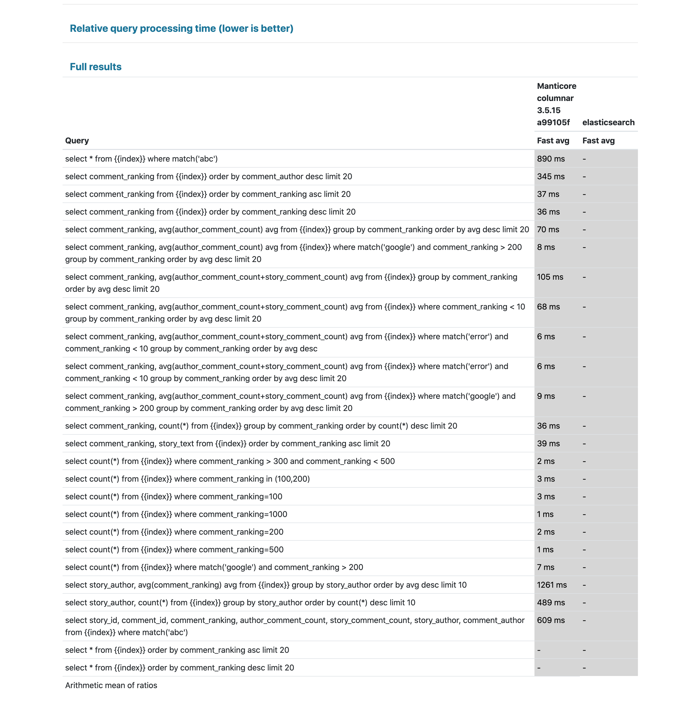
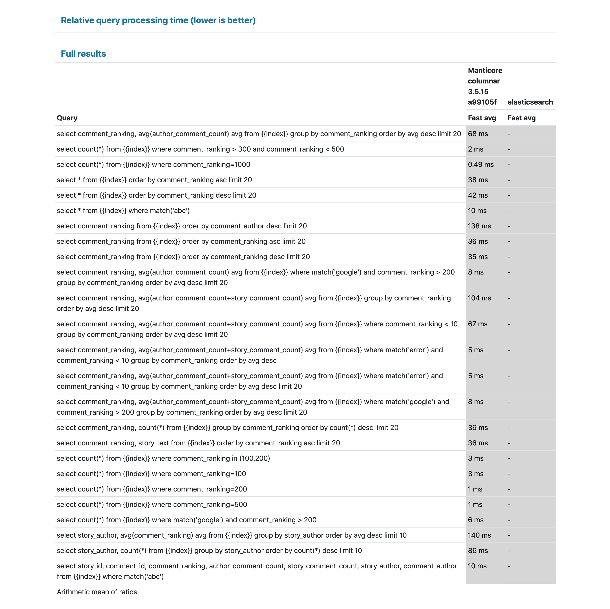
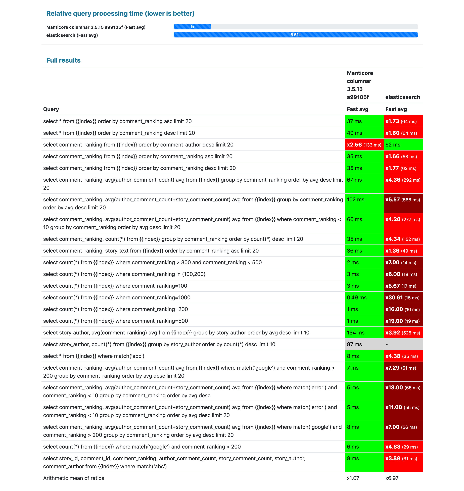
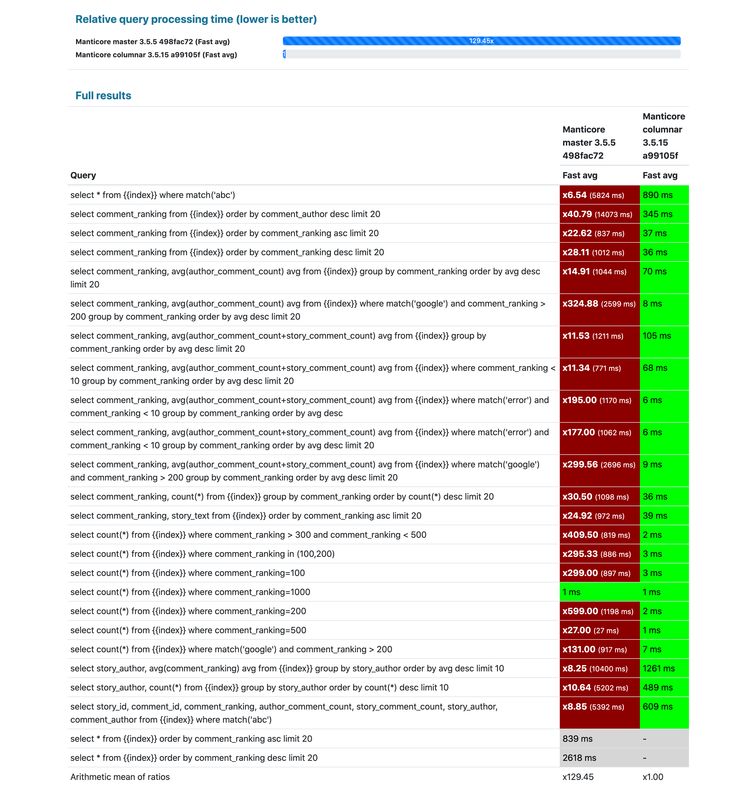
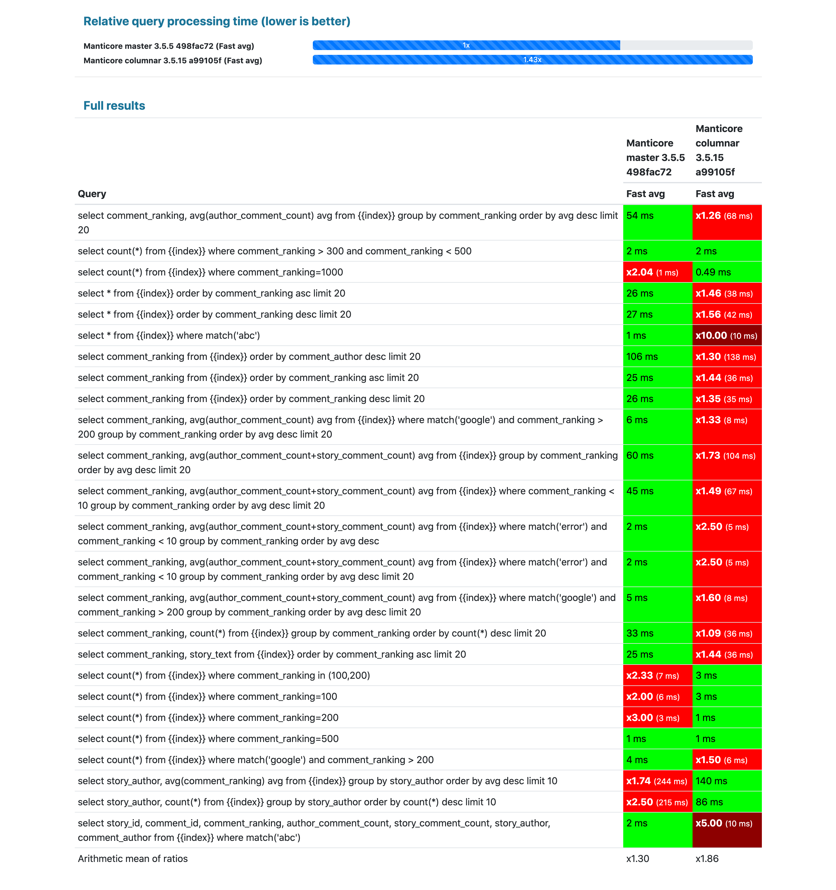
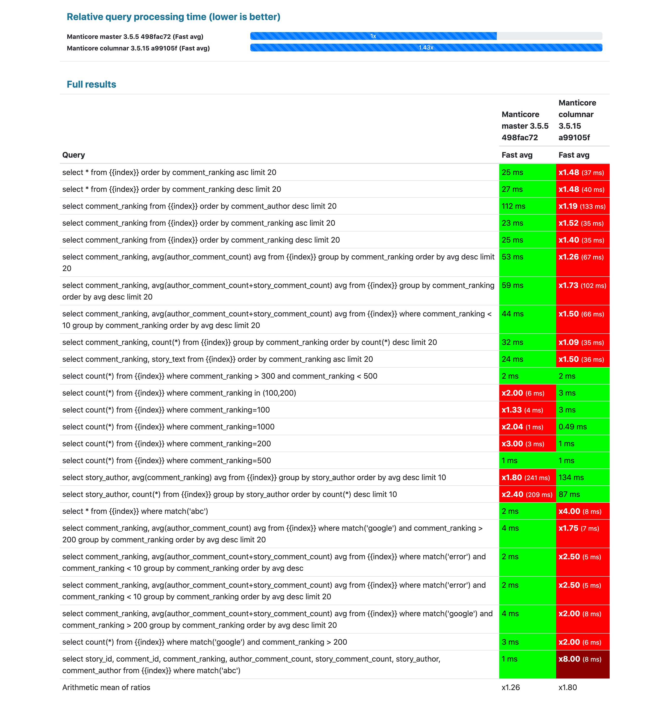
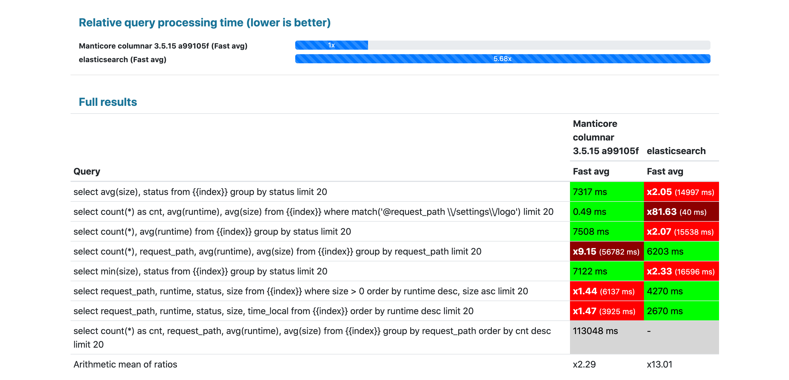
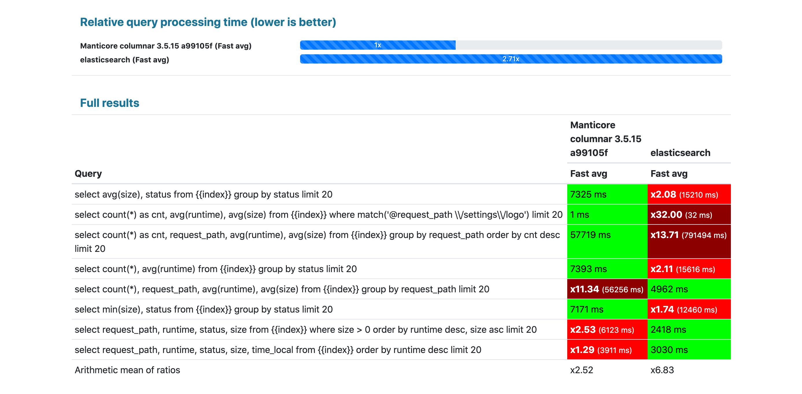
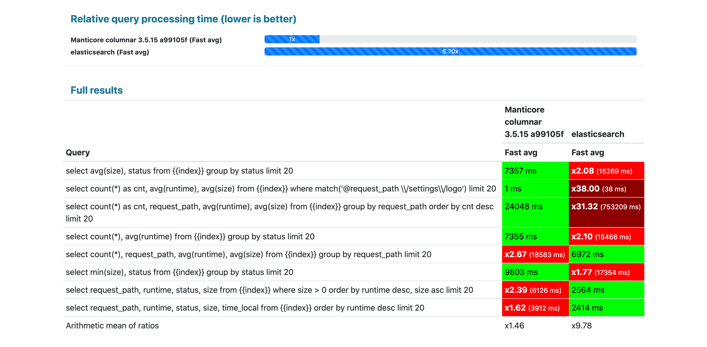

<p align="center">
  <a href="https://manticoresearch.com" target="_blank" rel="noopener">
    
  </a>
</p>

<h1 align="center">
  Manticore Columnar Library 1.11.4
</h1>

Manticore Columnar Library is a column-oriented storage library, aiming to provide **decent performance with low memory footprint at big data volume**.
When used in combination with [Manticore Search](https://github.com/manticoresoftware/manticoresearch) can be beneficial for those looking for:
1. log analytics including rich free text search capabities (which is missing in e.g. [Clickhouse](https://github.com/ClickHouse/ClickHouse) - great tool for metrics analytics)
2. faster / low resource consumption log/metrics analytics. Since the library and Manticore Search are both written in C++ with low optimizations in mind in many cases the performance / RAM consumption is better than in Lucene / SOLR / Elasticsearch
3. running log / metric analytics in docker / kubernetes. Manticore Search + the library can work with as little as 30 megabytes of RAM which Elasticsearch / Clickhouse can't. It also starts in less than a second or few seconds in the worst case. Since the overhead is so little you can afford having more nodes of Manticore Search + the library than Elasticsearch. More nodes and quicker start means higher high availability and agility.
4. powerful SQL for logs/metrics analytics and everything else [Manticore Search](https://github.com/manticoresoftware/manticoresearch) can give you

## Getting started

### Installation from yum/apt repositories
#### Ubuntu, Debian:
```bash
wget https://repo.manticoresearch.com/manticore-repo.noarch.deb
sudo dpkg -i manticore-repo.noarch.deb
sudo apt update
sudo apt install manticore manticore-columnar-lib
```

#### Centos:
```bash
sudo yum install https://repo.manticoresearch.com/manticore-repo.noarch.rpm
sudo yum install manticore manticore-columnar-lib
```

`searchd -v` should include `columnar x.y.z`, e.g.:
```bash
root@srv# searchd -v
Manticore 4.0.2 af497f245@210921 release (columnar 1.11.2 69d3780@210921)
```

### Basic usage:
1. Read https://manual.manticoresearch.com/Creating_an_index/Data_types#How-to-switch-between-the-storages
2. Create plain or real-time index specifying that the columnar storage should be used

## Benchmark "Hacker News comments"

Goal: compare Manticore Columnar Library + Manticore Search on mostly analytical queries with:
1. Manticore Search with its traditional storage
2. Elasticsearch version 7.9.1

Dataset: 1,165,439 [Hacker News curated comments](https://zenodo.org/record/45901/) with numeric fields

Infrastructure: 
* Specially dedicated empty server with no noise load
* CPU: 6*2 Intel(R) Core(TM) i7-3930K CPU @ 3.20GHz
* RAM: 64GB
* Storage: HDD (not SSD)
* Software and test specifics: 
  - docker in privileged mode
  - RAM limit with help of Linux cgroups
  - CPU limit to only 2 virtual cores (one physical core)
  - restarting each engine before each query, then running 10 queries one by one
  - dropping OS cache before each query
  - disabled query cache
  - capturing: slowest response time (i.e. cold OS cache) and avg(top 80% fastest) ("Fast avg", shown on the pictures)
  - one shard in Elasticsearch, one plain index in Manticore Search
  - no fine-tuning in either of the engines, just default settings + same field data types everywhere
  - heap size for Elasticsearch - 50% of RAM
  - if a query fails in either of the engines it's not accounted for in the total calculation 
* The RAM constraints are based on what Manticore Search traditional storage requires: 
  - 30MB - ~1/3 of the minimum requirement for Manticore Search with the traditional storage for good performance in this case (89MB)
  - 100MB - enough for all the attributes (89MB) to be put in RAM
  - 1024MB - enough for all the index files (972MB) to be put in RAM

### Results:

#### Elasticsearch vs Manticore with 30MB RAM limit - Elasticsearch failed on start


#### Elasticsearch vs Manticore with 100MB RAM limit - Elasticsearch failed on start


#### Elasticsearch vs Manticore with 1024MB RAM limit - Elasticsearch is 6.51x slower


#### Manticore GA vs Manticore + Columnar with 30MB RAM limit - the columnar lib is 129.45x faster


#### Manticore GA vs Manticore + Columnar with 100MB RAM limit - the columnar lib is 1.43x slower


#### Manticore GA vs Manticore + Columnar with 1024MB RAM limit - the columnar lib is 1.43x slower


## Benchmark "116M nginx log records"

Goal: compare Manticore Columnar Library + Manticore Search vs Elasticsearch 7.9.1 on typical log analysis queries with.

Dataset: 116M docs generated with help of [Nginx Log Generator](https://github.com/kscarlett/nginx-log-generator) like this:
```
docker pull kscarlett/nginx-log-generator
docker run -d -e "RATE=1000000" --name nginx-log-generator kscarlett/nginx-log-generator
```

Same infrastructure as in the previous benchmark.
* The RAM constraints are based on what Manticore Search traditional storage requires: 
  - 1500MB - ~1/3 of the minimum requirement for Manticore Search with the traditional storage for good performance in this case
  - 4400MB - enough for all the attributes to be put in RAM
  - 36000MB - enough for all the index files to be put in RAM

#### Elasticsearch vs Manticore with 1500MB RAM limit - Elasticsearch is 5.68x slower than Manticore Columnar Library:


#### Elasticsearch vs Manticore with 4400MB RAM limit - Elasticsearch is 2.71x slower than Manticore Columnar Library:


#### Elasticsearch vs Manticore with 46000MB RAM limit - Elasticsearch is 6.7x slower than Manticore Columnar Library:


# Work in progress

The benchmarks reveal some problems we are working on:
* Secondary indexes. There's no secondary indexes in the library while in Elasticsearch every field is indexed by default. Hence worse performance on some queries that heavily depend on filtering performance.
* Grouping by strings. Elasticsearch does it faster in the logs benchmark.

